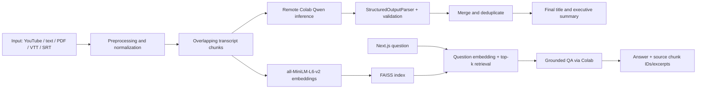

# MeetingMind

**AI Meeting Intelligence — turn meeting transcripts into structured, source-grounded summaries, decisions, and actionable tasks.**


## Overview

MeetingMind helps turn a meeting transcript into a useful record of what was discussed and what happens next. It extracts an executive summary, explicit decisions, follow-up tasks, key points, and unresolved questions. A retrieval-augmented question-answering flow finds relevant transcript segments before the remote language model responds, and exposes those source excerpts alongside supported answers.

MeetingMind transforms English meeting transcripts into structured, searchable intelligence. The repository contains two complementary experiences:

- **Product implementation:** a typed FastAPI backend, local CPU embeddings and FAISS retrieval, and a responsive Next.js dashboard.
- **Remote inference:** a temporary Google Colab GPU service running a Hugging Face instruction model. The frontend communicates only with the local FastAPI backend.

The backend never downloads or loads LLM weights locally. The Colab notebook checks its assigned GPU at runtime and selects one suitable Qwen2.5 instruction model in 4-bit NF4. Colab is temporary development/demo infrastructure; its endpoint exists only while the runtime is active.

## Features

- Executive summaries and meeting titles.
- Explicitly stated decisions with source chunk references.
- Action-item extraction with owner, deadline, priority, and transcript source.
- Missing owners, deadlines, and priority remain unset rather than being guessed.
- FAISS-based retrieval-augmented Q&A with source IDs and excerpts.
- English YouTube captions, pasted transcript, and PDF/TXT/VTT/SRT file inputs.
- Remote Colab GPU inference with a Hugging Face Qwen2.5 instruction model.
- Local CPU `sentence-transformers/all-MiniLM-L6-v2` embeddings and in-memory FAISS indexing.
- CSV and Markdown meeting exports.
- Colab inference-only notebook and Next.js product UI.
- Deterministic sample meeting that demonstrates an explicitly unassigned task without loading model weights.

## Architecture



## AI Pipeline

1. **Input and cleaning:** load English YouTube captions, pasted text, or supported files; validate extensions, size, encoding, and readable content.
2. **Chunking:** split transcripts into overlapping word windows with stable `chunk-NNN` source IDs and a configured processing cap.
3. **Extraction:** call a LangChain `LLMChain`/`PromptTemplate` for each source chunk. Instructions require facts to be explicitly stated and missing task metadata to be `null`.
4. **Structured parsing:** parse model output using `StructuredOutputParser` and `ResponseSchema`. A JSON fallback handles responses without the expected code fence; Pydantic models validate priorities and normalize missing values.
5. **Aggregation:** deduplicate repeated decisions, tasks, points, and questions while combining their source references. A final chain produces the meeting title and executive summary from chunk extractions.
6. **Indexing:** embed transcript chunks using normalized `all-MiniLM-L6-v2` vectors and build a per-meeting FAISS inner-product index.
7. **Grounded Q&A:** embed a question, retrieve top-k transcript chunks, apply a configurable similarity threshold, and send only the retrieved excerpts to the Colab QA endpoint.

Generative systems cannot guarantee factuality from prompting alone. Check cited excerpts before acting on meeting notes. The retrieval score threshold is a heuristic, not calibrated confidence.

## Tech Stack

| Area | Technology |
|---|---|
| AI / NLP | Colab Transformers, runtime-selected Qwen2.5 4-bit NF4, local sentence-transformers and FAISS |
| Chains / parsing | LangChain `LLMChain`, `PromptTemplate`, `StructuredOutputParser`, `ResponseSchema` |
| Backend | Python 3.11, FastAPI, Pydantic, Uvicorn |
| Frontend | Next.js 16, React 19, TypeScript |
| Inputs | youtube-transcript-api, pypdf |
| Inference | Google Colab GPU, temporary Cloudflare Tunnel endpoint |
| Infrastructure | Docker, Docker Compose, CPU-only API container |

## Curriculum Mapping

| Tips Hindawi topic | MeetingMind implementation |
|---|---|
| Transformers | Runtime-selected Qwen2.5 in `notebooks/MeetingMind_Colab_Inference.ipynb` |
| Prompt engineering | Explicit extraction and retrieved-context QA prompts |
| LangChain | `LLMChain` + `PromptTemplate` with a remote inference adapter |
| Structured output | `StructuredOutputParser` + `ResponseSchema` and injected format instructions |
| RAG | Overlapping transcript chunks, top-k retrieval, and FAISS |
| Embeddings | `sentence-transformers/all-MiniLM-L6-v2` |
| YouTube transcript | `youtube-transcript-api`, `extract_video_id()`, English captions |
| PDF processing | `pypdf.PdfReader` |
| UI | Colab inference notebook; Next.js/TypeScript product frontend |

## Installation

### 1. Clone

```powershell
git clone <your-repository-url>
cd MeetingMind
```

### 2–4. Python, packages, and environment

Use Python 3.11. The local backend requires no NVIDIA GPU; it runs embeddings and FAISS on CPU. LLM weights are loaded only in the Colab GPU runtime.

```powershell
py -3.11 -m venv .venv
.\.venv\Scripts\Activate.ps1
python -m pip install --upgrade pip
python -m pip install -r requirements.txt
Copy-Item .env.example .env
```

### 5. Start remote AI inference in Colab

1. Open [notebooks/MeetingMind_Colab_Inference.ipynb](./notebooks/MeetingMind_Colab_Inference.ipynb) in Google Colab and select a GPU runtime.
2. Run the notebook cells. The notebook prints the assigned GPU and VRAM, selects a fitting Qwen2.5 model, and starts the protected inference API while the model loads.
3. Wait until the notebook's `/health` check reports `model_ready: true`.
4. Copy the printed temporary endpoint and API key into `.env` as `LLM_BASE_URL` and `LLM_API_KEY`.

### 6. Run the backend

From the repository root, with the Python environment activated:

```powershell
$env:CORS_ORIGINS = "http://localhost:3000,http://127.0.0.1:3000,http://meetingmind.local:3000"
python -m uvicorn backend.app.api.main:app --reload --port 8000
```

The process starts without downloading LLM weights. Set `LLM_BASE_URL` and `LLM_API_KEY` in `.env` using the active Colab session values. `GET http://localhost:8000/api/health` checks the remote service with a short bounded timeout without loading the model. The header refreshes status periodically and separately displays local API connectivity, remote GPU detection, and remote model readiness. It only reports `AI Ready` when Colab confirms `model_ready: true`; unavailable/stopped runtimes are shown as unavailable with a safe explanation.

### 7. Run the frontend

In a second terminal:

```powershell
cd frontend
npm ci
Copy-Item .env.local.example .env.local
npm run dev
```

### 8. Analyse a meeting and test grounded Q&A

1. Keep the Colab runtime active, and start or restart MeetingMind after setting `LLM_BASE_URL` and `LLM_API_KEY`.
2. Open the local frontend, load a transcript, and run **Analyse Meeting**. Review the summary, decisions, tasks, key points, and open questions.
3. Ask **What is Alex responsible for?** and inspect the cited transcript source.
4. Ask **What was the company's revenue last quarter?**; when absent from the transcript, MeetingMind returns `I couldn't find this information in the meeting.`
5. The Colab endpoint is temporary development/demo infrastructure and exists only while that runtime is active.

#### Use `meetingmind.local` on Windows

The frontend stays on port `3000`. Add a loopback entry to the Windows hosts file so the development hostname resolves to this computer:

1. Open Notepad as Administrator.
2. Open `%SystemRoot%\System32\drivers\etc\hosts` (choose **All files** in the file picker).
3. Add this line and save:

   ```text
   127.0.0.1 meetingmind.local
   ```

4. If Windows keeps a cached lookup, run `ipconfig /flushdns` in a terminal.

Run the backend with both browser origins allowed as shown above, then start the frontend with `npm run dev`. Open **http://meetingmind.local:3000**. **http://localhost:3000** continues to work on the same port. The API remains at **http://localhost:8000**. If using Docker Compose, keep both origins in `CORS_ORIGINS` in `.env` (the supplied `.env.example` includes both).

The deterministic sample populates the dashboard without a GPU or Colab session. Real analysis and meeting Q&A require an active remote inference service.

## API Contract

The FastAPI base URL is `http://localhost:8000`; routes are prefixed with `/api`.

### `GET /api/health`

```json
{
  "status": "degraded",
  "api_status": "connected",
  "model_status": "unavailable",
  "model_status_detail": "The Colab inference service is not configured or unavailable.",
  "model_ready": false,
  "gpu_available": false,
  "model_name": "Hugging Face model on Colab"
}
```

`model_ready` is true only when the Colab service confirms that both model and tokenizer are loaded and usable. Local GPU presence does not indicate remote model readiness. Health checks do not initialize the model.

### `POST /api/analyse`

Multipart form data: `source_type` is `youtube`, `text`, or `upload`; supply `youtube_url`, `transcript`, or a `file` respectively. The typed response includes `meeting_id`, title, executive summary, decisions, tasks, key points, open questions, word count, estimated duration, and chunk-cap status. Decisions and tasks carry source chunk IDs and excerpts.

### `POST /api/qa`

```json
{ "meeting_id": "session-id", "question": "What did the team decide?" }
```

Response:

```json
{
  "answer": "The team agreed to keep the current pricing page for launch.",
  "found": true,
  "sources": [
    { "chunk_id": "chunk-002", "excerpt": "…", "score": 0.74 }
  ]
}
```

If retrieval is insufficient, the API returns `found: false`, no sources, and: `I couldn't find this information in the meeting.`

### `POST /api/sample`

Returns a deterministic, built-in meeting report and registers source excerpts without loading model weights.

### Downloads

`GET /api/meetings/{meeting_id}/downloads?format=csv|markdown` returns action items as CSV or a full meeting-notes Markdown export.

## Docker

Docker runs only the Next.js frontend and local FastAPI backend. The API container uses CPU-only PyTorch for local embeddings and FAISS; it does not need GPU passthrough or download LLM weights. The remote instruction model runs only in the temporary Colab runtime.

```powershell
Copy-Item .env.example .env
notepad .env
docker compose up --build -d
docker compose ps
```

In `.env`, set `LLM_BASE_URL` to the current Colab HTTPS tunnel origin and `LLM_API_KEY` to the private key printed by the notebook. Keep the key out of Git and do not include a `/health`, `/analyse`, or `/qa` suffix in the URL. Compose passes the URL and key to the backend container at runtime; the frontend bundle receives only the browser-visible API origin.

The Compose services are `api` and `frontend`; Colab remains outside Docker. The browser calls FastAPI at `http://localhost:8000`, while the frontend page is at `http://localhost:3000`. `NEXT_PUBLIC_API_BASE_URL` must be reachable by the browser (default `http://localhost:8000`), not a Compose-only service name such as `http://api:8000`.

If either default host port is already in use, set `API_HOST_PORT` and/or `FRONTEND_HOST_PORT` in `.env`. When changing the API port, also set `NEXT_PUBLIC_API_BASE_URL` to `http://localhost:<API_HOST_PORT>` so browser requests reach the published API port.

Check the API status without exposing configuration values:

```powershell
$health = Invoke-RestMethod http://localhost:8000/api/health
$health | Select-Object status, api_status, model_status, model_ready, gpu_available, model_name
Invoke-WebRequest http://localhost:3000 -UseBasicParsing | Select-Object StatusCode
```

`status: degraded` and `model_ready: false` mean the local API is responding but Colab is not ready or configured; they do not prevent the deterministic sample from working. The API container's Docker health check verifies that the local health route responds, not that Colab inference is ready.

Useful operations:

```powershell
docker compose logs --tail 100 api frontend
docker compose logs -f api
# After the Colab tunnel URL/key changes, update .env and recreate only the API container:
docker compose up -d --force-recreate api
# Stop the demo while retaining the MeetingMind embedding-cache volume:
docker compose down
```

If Colab is stopped or its temporary tunnel URL changes, start the notebook and wait for model readiness, update `LLM_BASE_URL` and `LLM_API_KEY` in `.env`, then recreate the API container. Do not use `docker compose down -v`; the backend meeting registry and FAISS indexes are in memory and are cleared when the API container restarts. The first analysis may download the small embedding model into the MeetingMind cache. The sample meeting works without Colab; real analysis and Q&A require the active remote service.

The backend uses its separate `meetingmind_model-cache` volume for embedding cache files. The previously configured `finalproject_model-cache` is owned by a different Compose project and is not mounted or modified by MeetingMind.

The Docker build uses `requirements-runtime.txt` so test-only packages are not installed in the API image. The API image explicitly installs and verifies CPU-only PyTorch. The frontend production server binds to `0.0.0.0:3000` in its container.

## Environment Variables

Copy `.env.example` to `.env` for Compose. Available settings:

| Variable | Purpose |
|---|---|
| `NEXT_PUBLIC_API_BASE_URL` | Browser-visible FastAPI base URL |
| `API_HOST_PORT` | Optional published host port for FastAPI (default `8000`) |
| `FRONTEND_HOST_PORT` | Optional published host port for Next.js (default `3000`) |
| `CORS_ORIGINS` | Comma-separated allowed browser origins |
| `LLM_BACKEND` | Must be `remote` |
| `LLM_BASE_URL` | Temporary Colab API base URL printed by the notebook |
| `LLM_API_KEY` | Temporary bearer key printed by the notebook; keep private |
| `LLM_REQUEST_TIMEOUT` | Maximum remote inference call duration in seconds |
| `LLM_HEALTH_TIMEOUT` | Bounded remote health check in seconds |
| `REMOTE_MODEL_NAME` | Display name when the remote health response has no model name |
| `EMBEDDING_MODEL` | Sentence-transformer repository |
| `MAX_CHUNKS`, `CHUNK_WORDS`, `CHUNK_OVERLAP` | Transcript work and chunk bounds |
| `RAG_TOP_K`, `MIN_RETRIEVAL_SCORE` | Retrieval count and heuristic cutoff |
| `MAX_UPLOAD_BYTES` | Maximum uploaded transcript size |

`.env.example` contains placeholders only. Never commit `.env`, API keys, model weights, or meeting data. Colab's Cloudflare Tunnel URL and key are temporary and should be replaced each runtime session.

## Demo

1. Start the app, then click **Try sample meeting** on the landing page.
2. Verify the legal-approval task has no assigned owner or deadline.
3. Review the overview, source-linked decisions, and action-item table.
4. Download action items as CSV or meeting notes as Markdown.
5. Open **Ask the meeting**, submit a question, and expand **View sources**.
6. For actual inference, start the Colab notebook, configure its endpoint and key in local `.env`, restart the backend, then use **Analyse a meeting**.

The exact notebook and web walkthroughs are in [docs/demo.md](./docs/demo.md).

## Project Structure

```text
MeetingMind/
├── backend/
│   ├── app/
│   │   ├── api/                 # FastAPI routes and app
│   │   ├── chains/              # Remote LLM adapter, prompts, and errors
│   │   ├── embeddings/           # MiniLM + FAISS
│   │   ├── loaders/              # YouTube, PDF, text, subtitle inputs
│   │   ├── parsers/              # Structured parsing and validation
│   │   ├── pipeline/             # Orchestration and sample data
│   │   ├── preprocessing/        # Transcript chunks
│   │   └── rag/                  # Retrieval-grounded QA
│   ├── tests/unit/               # Model-independent tests
│   └── README.md
├── data/                         # Local data only; ignored by Git
├── docs/                         # Architecture, pipeline, demo
├── frontend/
│   ├── app/                      # Next.js routes and global styles
│   ├── components/               # Product workspace
│   ├── lib/                      # Typed API client and contracts
│   └── Dockerfile
├── notebooks/
│   ├── MeetingMind_Colab_Inference.ipynb
│   └── MeetingMind_Final_Project.ipynb # Archived local prototype; do not run
├── .env.example
├── docker-compose.yml
├── Dockerfile
├── LICENSE
├── pytest.ini
└── requirements.txt
```

## Tests and Quality Checks

Run model-independent backend tests:

```powershell
python -m pytest backend/tests/unit
```

Run frontend checks:

```powershell
cd frontend
npm run typecheck
npm run lint
npm run build
```

These checks do not load an LLM or require a local GPU. Real model inference and live YouTube captions require their corresponding remote runtime/network resources.

## Limitations

- Inference requires an active Colab GPU runtime and internet access; the temporary endpoint is not production infrastructure.
- The Colab runtime downloads model weights to its own ephemeral storage. No LLM weights are downloaded by the local Docker stack.
- First use downloads the local embedding model and may take time.
- MeetingMind is English-first. YouTube input requires an accessible video with English captions.
- PDF support extracts embedded text; scanned image-only PDFs need OCR, which is not included.
- Transcript quality, English language, speaker labels, and subtitle timing affect extraction quality.
- Extraction prompts and schemas constrain unsupported values but cannot guarantee zero hallucinations; review source evidence.
- RAG confidence uses a configurable similarity heuristic; it is not a calibrated probability.
- Meeting sessions and FAISS indexes are in-memory only, bounded, and lost on API restart.
- Authentication, persistent storage, speaker diarization, OCR, and production deployment controls are not implemented.

## Future Improvements

Potential extensions include evaluated multilingual embedding models, temporal retrieval, speaker diarization, durable meeting history, authentication, and a production deployment profile. These are not current features.

## License

Released under the [MIT License](./LICENSE).
