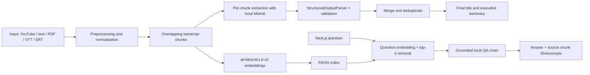

# MeetingMind

**AI Meeting Intelligence — turn meeting transcripts into structured, source-grounded summaries, decisions, and actionable tasks.**


## Overview

MeetingMind helps turn a meeting transcript into a useful record of what was discussed and what happens next. It extracts an executive summary, explicit decisions, follow-up tasks, key points, and unresolved questions. A retrieval-augmented question-answering flow finds relevant transcript segments before the local language model responds, and exposes those source excerpts alongside supported answers.

The repository contains two complementary experiences:

- **Educational implementation:** a standalone Jupyter notebook with Gradio that demonstrates the course techniques end to end.
- **Product implementation:** a typed FastAPI integration layer and a responsive Next.js dashboard.

The application runs Mistral Nemo locally through Transformers and does not call OpenAI, Gemini, or a hosted LLM API. Inference requires a supported CUDA GPU.

## Features

- Executive summaries and meeting titles.
- Explicitly stated decisions with source chunk references.
- Action-item extraction with owner, deadline, priority, and transcript source.
- Missing owners, deadlines, and priority remain unset rather than being guessed.
- FAISS-based retrieval-augmented Q&A with source IDs and excerpts.
- YouTube captions, pasted transcript, and PDF/TXT/VTT/SRT file inputs.
- Arabic and English YouTube caption retrieval; multilingual pasted/uploaded text is accepted.
- Local `mistralai/Mistral-Nemo-Instruct-2407` inference in 4-bit mode.
- `sentence-transformers/all-MiniLM-L6-v2` embeddings and in-memory FAISS indexing.
- CSV and Markdown meeting exports.
- Gradio notebook demo and independent Next.js product UI.
- Deterministic sample meeting that demonstrates an explicitly unassigned task without loading model weights.

## Architecture



## AI Pipeline

1. **Input and cleaning:** load Arabic/English YouTube captions, pasted text, or supported files; validate extensions, size, encoding, and readable content.
2. **Chunking:** split transcripts into overlapping word windows with stable `chunk-NNN` source IDs and a configured processing cap.
3. **Extraction:** call a LangChain `LLMChain`/`PromptTemplate` for each source chunk. Instructions require facts to be explicitly stated and missing task metadata to be `null`.
4. **Structured parsing:** parse model output using `StructuredOutputParser` and `ResponseSchema`. A JSON fallback handles responses without the expected code fence; Pydantic models validate priorities and normalize missing values.
5. **Aggregation:** deduplicate repeated decisions, tasks, points, and questions while combining their source references. A final chain produces the meeting title and executive summary from chunk extractions.
6. **Indexing:** embed transcript chunks using normalized `all-MiniLM-L6-v2` vectors and build a per-meeting FAISS inner-product index.
7. **Grounded Q&A:** embed a question, retrieve top-k transcript chunks, apply a configurable similarity threshold, and pass only the retrieved excerpts into the local Mistral QA chain.

Generative systems cannot guarantee factuality from prompting alone. Check cited excerpts before acting on meeting notes. The retrieval score threshold is a heuristic, not calibrated confidence.

## Tech Stack

| Area | Technology |
|---|---|
| AI / NLP | Transformers 4.52.4, Mistral Nemo, bitsandbytes 4-bit, sentence-transformers, FAISS |
| Chains / parsing | LangChain `LLMChain`, `PromptTemplate`, `StructuredOutputParser`, `ResponseSchema` |
| Backend | Python 3.11, FastAPI, Pydantic, Uvicorn |
| Frontend | Next.js 16, React 19, TypeScript |
| Inputs | youtube-transcript-api, pypdf |
| Educational UI | Gradio 5 |
| Infrastructure | Docker, Docker Compose, CUDA-enabled PyTorch image |

## Curriculum Mapping

| Tips Hindawi topic | MeetingMind implementation |
|---|---|
| Transformers | `mistralai/Mistral-Nemo-Instruct-2407` via `AutoModelForCausalLM` |
| Prompt engineering | Explicit extraction and retrieved-context QA prompts |
| LangChain | `LLMChain` + `PromptTemplate` with a custom local Transformers `LLM` wrapper |
| Structured output | `StructuredOutputParser` + `ResponseSchema` and injected format instructions |
| RAG | Overlapping transcript chunks, top-k retrieval, and FAISS |
| Embeddings | `sentence-transformers/all-MiniLM-L6-v2` |
| YouTube transcript | `youtube-transcript-api`, `extract_video_id()`, Arabic/English captions |
| PDF processing | `pypdf.PdfReader` |
| UI | Gradio in the notebook; Next.js/TypeScript product frontend |

## Installation

### 1. Clone

```powershell
git clone <your-repository-url>
cd MeetingMind
```

### 2–4. Python, packages, and GPU

Use Python 3.11 (recommended for the pinned PyTorch/model stack) and a CUDA-capable GPU. A T4 with 16 GB VRAM is the intended notebook target; actual peak memory depends on runtime and input length.

```powershell
py -3.11 -m venv .venv
.\.venv\Scripts\Activate.ps1
python -m pip install --upgrade pip
python -m pip install torch==2.6.0 --index-url https://download.pytorch.org/whl/cu124
python -m pip install -r requirements.txt
```

The PyTorch command above is for CUDA 12.4. Choose the matching command for your operating system and CUDA runtime from the official PyTorch installation selector. The model may require accepting its Hugging Face license before downloading; use an environment-based Hugging Face token only if the model repository requires authentication. Never commit that token.

### 5. Run the educational notebook

Open [notebooks/MeetingMind_Final_Project.ipynb](./notebooks/MeetingMind_Final_Project.ipynb) in Colab or Kaggle, enable a GPU runtime, and run cells in order. Gradio creates a temporary share link when launched. A share link is public to anyone who has it; do not upload confidential meeting transcripts to a public demo.

### 6. Run the backend

From the repository root, with the Python environment activated:

```powershell
$env:CORS_ORIGINS = "http://localhost:3000,http://127.0.0.1:3000,http://meetingmind.local:3000"
python -m uvicorn backend.app.api.main:app --reload --port 8000
```

The process starts without downloading model weights. `GET http://localhost:8000/api/health` reports API reachability, GPU hardware detection, and the actual local model lifecycle (`ready`, `loading`, or `unavailable`) without loading the model. GPU detection uses CUDA when PyTorch is installed and falls back to the NVIDIA driver query; detected hardware does not imply that CUDA inference or the model is ready. The first `/api/analyse` or `/api/qa` request lazily loads model and embedding weights. The frontend header refreshes the backend status every 8 seconds and shows API connectivity, GPU detection, and model readiness separately; load failures expose a safe, user-facing explanation without stack traces. The model remains unavailable until Mistral Nemo and its required components have loaded successfully. A 4 GB laptop GPU may not provide enough VRAM for reliable Mistral Nemo 12B 4-bit inference; the UI reports the backend's unavailable state rather than switching models or claiming readiness.

### 7. Run the frontend

In a second terminal:

```powershell
cd frontend
npm ci
Copy-Item .env.local.example .env.local
npm run dev
```

#### Use `meetingmind.local` on Windows

The frontend stays on port `3000`. Add a loopback entry to the Windows hosts file so the development hostname resolves to this computer:

1. Open Notepad as Administrator.
2. Open `%SystemRoot%\System32\drivers\etc\hosts` (choose **All files** in the file picker).
3. Add this line and save:

   ```text
   127.0.0.1 meetingmind.local
   ```

4. If Windows keeps a cached lookup, run `ipconfig /flushdns` in a terminal.

Run the backend with both browser origins allowed as shown above, then start the frontend with `npm run dev`. Open **http://meetingmind.local:3000**. **http://localhost:3000** continues to work on the same port. The API remains at **http://localhost:8000**. If using Docker Compose, keep both origins in `CORS_ORIGINS` in `.env` (the supplied `.env.example` includes both).

The deterministic sample populates the dashboard without a GPU; real inference and sample Q&A require the CUDA-enabled backend.

## API Contract

The FastAPI base URL is `http://localhost:8000`; routes are prefixed with `/api`.

### `GET /api/health`

```json
{
  "status": "degraded",
  "api_status": "connected",
  "model_status": "unavailable",
  "model_status_detail": "The model has not been loaded yet. It will load when you analyze a meeting.",
  "model_ready": false,
  "gpu_available": false,
  "model_name": "mistralai/Mistral-Nemo-Instruct-2407"
}
```

`model_ready` remains available for compatibility and is true only after Mistral Nemo, embeddings, and analysis chains have all loaded successfully. GPU memory failures are reported as a safe hardware requirement message; detailed exceptions remain in API logs.

### `POST /api/analyse`

Multipart form data: `source_type` is `youtube`, `text`, or `upload`; supply `youtube_url`, `transcript`, or a `file` respectively. The typed response includes `meeting_id`, title, executive summary, decisions, tasks, key points, open questions, word count, estimated duration, and chunk-cap status. Decisions and tasks carry source chunk IDs and excerpts.

### `POST /api/qa`

```json
{ "meeting_id": "session-id", "question": "What did the team decide?" }
```

Response:

```json
{
  "answer": "The team agreed to keep the current pricing page for launch.",
  "found": true,
  "sources": [
    { "chunk_id": "chunk-002", "excerpt": "…", "score": 0.74 }
  ]
}
```

If retrieval is insufficient, the API returns `found: false`, no sources, and: `I couldn't find this information in the meeting.`

### `POST /api/sample`

Returns a deterministic, built-in meeting report and registers source excerpts without loading model weights.

### Downloads

`GET /api/meetings/{meeting_id}/downloads?format=csv|markdown` returns action items as CSV or a full meeting-notes Markdown export.

## Docker

The backend image uses a CUDA 12.4 PyTorch runtime and includes a C/C++ compiler toolchain required by Triton/bitsandbytes initialization. Docker Desktop/Linux must have a working NVIDIA Container Toolkit/GPU configuration to run inference. Model weights are downloaded on first use and cached in a named volume.

**Hardware requirement:** the reference environment is an NVIDIA T4 with 16 GB VRAM or equivalent. A local RTX 3050 Ti with 4 GB VRAM is insufficient for the current Mistral Nemo 12B 4-bit inference setup.

```powershell
Copy-Item .env.example .env
# Edit .env and set a long random JUPYTER_TOKEN before exposing the notebook profile.
docker compose up --build
```

The web UI is at `http://localhost:3000`; the API is at `http://localhost:8000`. To also start JupyterLab for the notebook, run:

```powershell
docker compose --profile notebook up --build
```

JupyterLab uses port 8888 and requires `JUPYTER_TOKEN` in `.env`. Do not expose it on an untrusted network. To rebuild after changing the frontend API origin, set `NEXT_PUBLIC_API_BASE_URL` in `.env` before building; this value is compiled into the browser bundle and is not a secret.

## Environment Variables

Copy `.env.example` to `.env` for Compose. Available settings:

| Variable | Purpose |
|---|---|
| `NEXT_PUBLIC_API_BASE_URL` | Browser-visible FastAPI base URL |
| `CORS_ORIGINS` | Comma-separated allowed browser origins |
| `MODEL_NAME` | Local Transformers model repository |
| `EMBEDDING_MODEL` | Sentence-transformer repository |
| `MODEL_MAX_NEW_TOKENS`, `MAX_INPUT_TOKENS` | Model generation/input bounds |
| `MAX_CHUNKS`, `CHUNK_WORDS`, `CHUNK_OVERLAP` | Transcript work and chunk bounds |
| `RAG_TOP_K`, `MIN_RETRIEVAL_SCORE` | Retrieval count and heuristic cutoff |
| `MAX_UPLOAD_BYTES` | Maximum uploaded transcript size |
| `JUPYTER_TOKEN` | Required only for the optional notebook container |

`.env.example` contains placeholders only. Never commit `.env`, access tokens, model weights, or meeting data.

## Demo

1. Start the app, then click **Try sample meeting** on the landing page.
2. Verify the legal-approval task has no assigned owner or deadline.
3. Review the overview, source-linked decisions, and action-item table.
4. Download action items as CSV or meeting notes as Markdown.
5. Open **Ask the meeting**, submit a question, and expand **View sources**.
6. For actual inference, use **Analyse a meeting** with a transcript, YouTube link, or supported file on a CUDA backend.

The exact notebook and web walkthroughs are in [docs/demo.md](./docs/demo.md).

## Project Structure

```text
MeetingMind/
├── backend/
│   ├── app/
│   │   ├── api/                 # FastAPI routes and app
│   │   ├── chains/              # Local LLM wrapper and prompts
│   │   ├── embeddings/           # MiniLM + FAISS
│   │   ├── loaders/              # YouTube, PDF, text, subtitle inputs
│   │   ├── parsers/              # Structured parsing and validation
│   │   ├── pipeline/             # Orchestration and sample data
│   │   ├── preprocessing/        # Transcript chunks
│   │   └── rag/                  # Retrieval-grounded QA
│   ├── tests/unit/               # Model-independent tests
│   └── README.md
├── data/                         # Local data only; ignored by Git
├── docs/                         # Architecture, pipeline, demo
├── frontend/
│   ├── app/                      # Next.js routes and global styles
│   ├── components/               # Product workspace
│   ├── lib/                      # Typed API client and contracts
│   └── Dockerfile
├── notebooks/
│   └── MeetingMind_Final_Project.ipynb
├── .env.example
├── docker-compose.yml
├── Dockerfile
├── LICENSE
├── pytest.ini
└── requirements.txt
```

## Tests and Quality Checks

Run model-independent backend tests:

```powershell
python -m pytest backend/tests/unit
```

Run frontend checks:

```powershell
cd frontend
npm run typecheck
npm run lint
npm run build
```

These checks do not load Mistral Nemo or require a GPU. Model inference, live YouTube captions, and Docker GPU execution are integration checks and require their corresponding runtime/network resources.

## Limitations

- Mistral Nemo 12B needs a CUDA GPU and substantial GPU memory even in 4-bit mode; CPU-only inference is not supported.
- First use downloads model and embedding weights and can take time.
- YouTube input requires an accessible video with English or Arabic captions.
- PDF support extracts embedded text; scanned image-only PDFs need OCR, which is not included.
- Transcript quality, language, speaker labels, and subtitle timing affect extraction quality.
- Extraction prompts and schemas constrain unsupported values but cannot guarantee zero hallucinations; review source evidence.
- RAG confidence uses a configurable similarity heuristic; it is not a calibrated probability.
- Meeting sessions and FAISS indexes are in-memory only, bounded, and lost on API restart.
- Authentication, persistent storage, speaker diarization, OCR, and production deployment controls are not implemented.

## Future Improvements

Potential extensions include evaluated multilingual embedding models, temporal retrieval, speaker diarization, durable meeting history, authentication, and a production deployment profile. These are not current features.

## License

Released under the [MIT License](./LICENSE).
