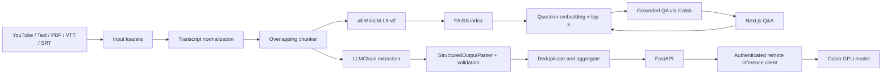

# Architecture

MeetingMind separates the Next.js product UI, local FastAPI processing backend, and temporary Colab GPU inference service. The browser communicates only with FastAPI. Transcript normalization, chunking, CPU embeddings, FAISS retrieval, parsing, and source attribution remain local; only language-model inference leaves the local backend.

## Responsibilities

- `backend/app/loaders/`: YouTube captions and PDF/text/subtitle reading; consistent user-facing validation.
- `backend/app/preprocessing/`: overlapping chunks with stable source IDs and bounded work.
- `backend/app/chains/`: remote Colab client/adapter, LangChain chains, and explicit extraction/grounding prompts.
- `backend/app/parsers/`: structured output parsing, null normalization, priority validation, and duplicate aggregation.
- `backend/app/embeddings/`: normalized MiniLM vectors and in-memory FAISS indexes.
- `backend/app/rag/`: top-k local retrieval, confidence threshold, remote grounded answer generation, and evidence references.
- `backend/app/pipeline/`: lazy local embedding initialization, remote model status, and bounded in-memory meeting registry.
- `backend/app/api/`: typed HTTP contract, CORS, health, analysis, sample, QA, and downloads.
- `frontend/`: responsive Next.js dashboard that communicates only with the HTTP API.
- `notebooks/MeetingMind_Colab_Inference.ipynb`: inference-only GPU service and temporary authenticated tunnel.

## API boundary

All routes are prefixed with `/api`. Analysis uses multipart form data so uploaded files do not need to be embedded in JSON. Analysis returns source-addressable decisions/tasks and meeting metrics. Q&A returns `answer`, `found`, and `sources` (`chunk_id`, excerpt, retrieval score). An out-of-session meeting ID returns 404. Model loading/inference failures return safe user-facing errors; stack traces stay in backend logs.

## State and privacy

The API keeps a bounded number of meetings and FAISS indexes in process memory only. It sends prompts and retrieved transcript excerpts to the configured Colab service. The temporary tunnel uses a bearer key but is development infrastructure, not a production security boundary. Uploaded meeting content is sensitive; do not send confidential data through a public tunnel.
