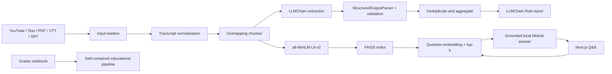

# Architecture

MeetingMind has three deliberately separate experiences: a self-contained educational notebook, a reusable Python API, and a Next.js product frontend. Gradio remains in the notebook as the curriculum UI. The browser app contains presentation and API-client code only; it never loads a model or embeds transcript text.

## Responsibilities

- `backend/app/loaders/`: YouTube captions and PDF/text/subtitle reading; consistent user-facing validation.
- `backend/app/preprocessing/`: overlapping chunks with stable source IDs and bounded work.
- `backend/app/chains/`: 4-bit Transformers wrapper, LangChain chains, and explicit extraction/grounding prompts.
- `backend/app/parsers/`: structured output parsing, null normalization, priority validation, and duplicate aggregation.
- `backend/app/embeddings/`: normalized MiniLM vectors and in-memory FAISS indexes.
- `backend/app/rag/`: top-k retrieval, confidence threshold, local answer generation, and evidence references.
- `backend/app/pipeline/`: lazy model lifecycle and bounded in-memory meeting registry.
- `backend/app/api/`: typed HTTP contract, CORS, health, analysis, sample, QA, and downloads.
- `frontend/`: responsive Next.js dashboard that communicates only with the HTTP API.
- `notebooks/`: full standalone curriculum notebook, including Gradio.

## API boundary

All routes are prefixed with `/api`. Analysis uses multipart form data so uploaded files do not need to be embedded in JSON. Analysis returns source-addressable decisions/tasks and meeting metrics. Q&A returns `answer`, `found`, and `sources` (`chunk_id`, excerpt, retrieval score). An out-of-session meeting ID returns 404. Model loading/inference failures return safe user-facing errors; stack traces stay in backend logs.

## State and privacy

The API keeps a bounded number of meetings and FAISS indexes in process memory only. It does not persist transcripts, use a hosted inference service, or provide authentication. Uploaded meeting content is sensitive: use only in a trusted environment and do not expose the demo API publicly without access control.
